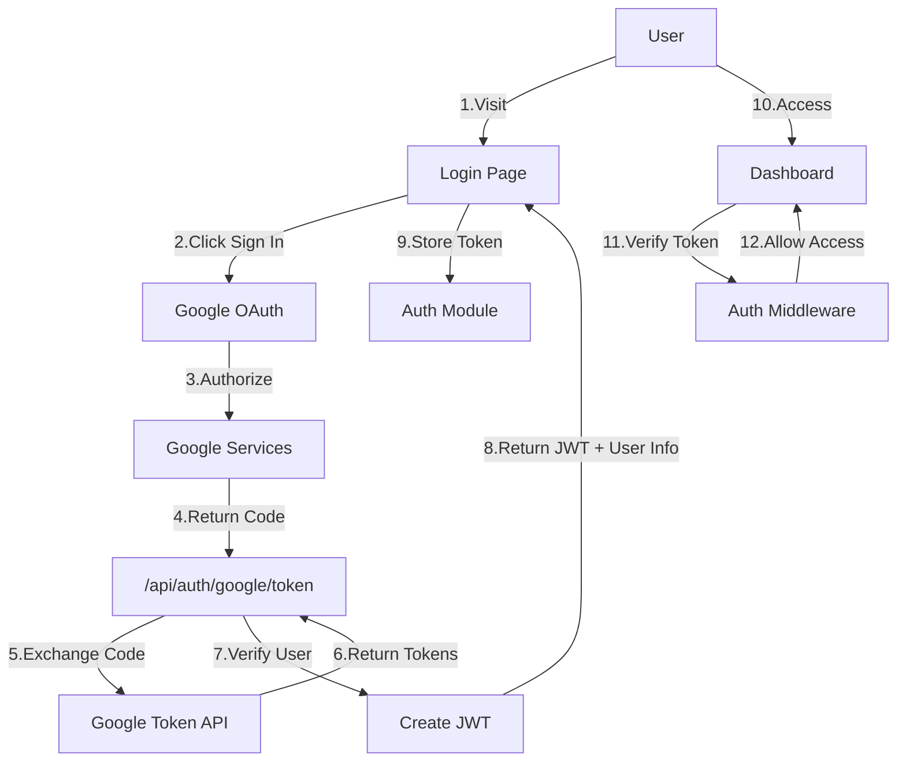
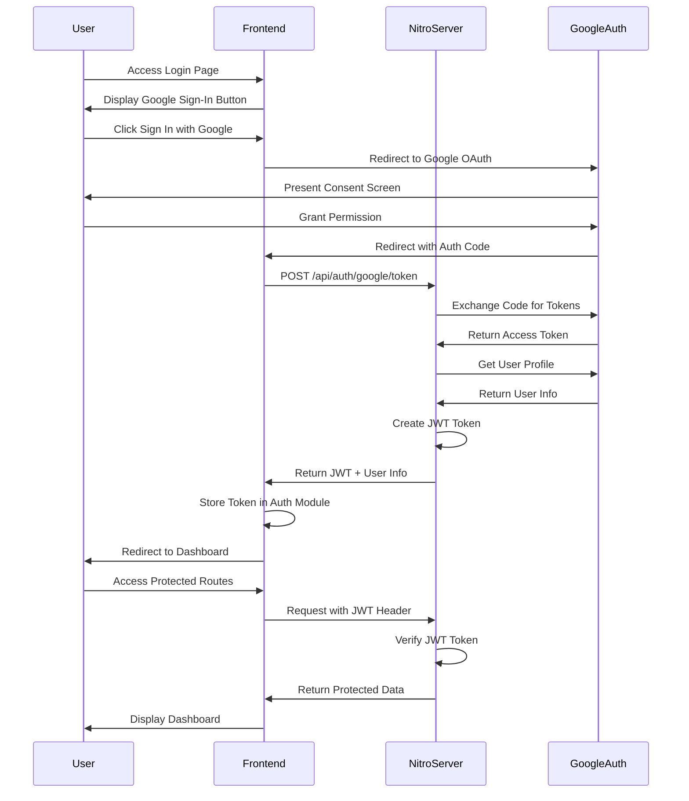
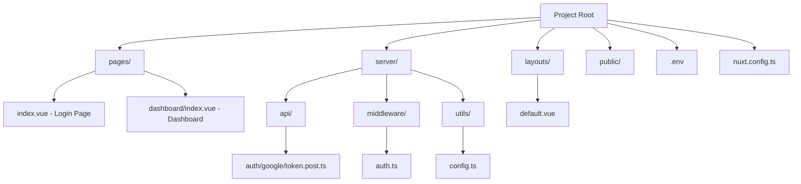
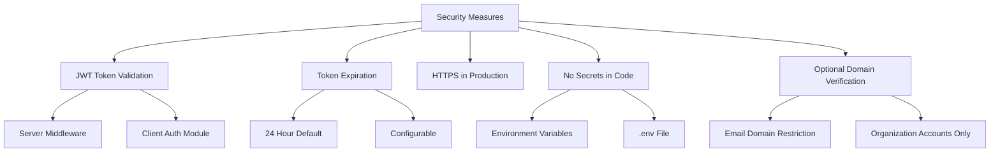

# Google Sign-In with Nuxt 3 and Nitro

A streamlined authentication solution using Google OAuth 2.0 in a Nuxt 3 application with Nitro server. This project demonstrates the implementation of Google Sign-In without database dependencies, using JWT tokens for session management.

## Architecture Overview



## Authentication Flow



## Project Structure



## Setup

### Prerequisites

1. Node.js 16.x or higher
2. Google Developer Console project with OAuth 2.0 credentials

### Getting Google OAuth Credentials

1. **Create a Google Cloud Platform Project**:
   - Go to [Google Cloud Console](https://console.cloud.google.com/)
   - Click on the project dropdown at the top of the page
   - Click "New Project"
   - Enter a project name and click "Create"

2. **Enable the Google OAuth API**:
   - From your project dashboard, navigate to "APIs & Services" > "Library"
   - Search for "Google OAuth API" or "Google Identity"
   - Click on "Google Identity Services (OAuth 2.0)"
   - Click "Enable"

3. **Configure the OAuth Consent Screen**:
   - Navigate to "APIs & Services" > "OAuth consent screen"
   - Select User Type (External or Internal)
   - Fill in the required fields:
     - App name
     - User support email
     - Developer contact information
   - Click "Save and Continue"
   - Add scopes: `email`, `profile`, and `openid`
   - Click "Save and Continue"
   - Add test users if needed (for external user type)
   - Click "Save and Continue"

4. **Create OAuth Client ID**:
   - Navigate to "APIs & Services" > "Credentials"
   - Click "Create Credentials" > "OAuth client ID"
   - Select Application type: "Web application"
   - Enter a name for your client
   - Under "Authorized JavaScript origins", add your development URL (e.g., `http://localhost:3000`)
   - Under "Authorized redirect URIs", add your callback URL (e.g., `http://localhost:3000/login`)
   - Click "Create"

5. **Save Your Credentials**:
   - A dialog will appear showing your Client ID and Client Secret
   - Save these values for use in your `.env` file
   - You can always view these credentials later in the "Credentials" section

### Environment Variables

Create a `.env` file in the root directory with the following variables:

```env
JWT_SECRET_KEY=your_secure_random_string
GOOGLE_CLIENT_ID=your_google_client_id
GOOGLE_CLIENT_SECRET=your_google_client_secret
GOOGLE_REDIRECT_URI=http://localhost:3000/login
```

### Installation

```bash
# Install dependencies
npm install

# Start development server
npm run dev
```

## Key Features

- **Token-Only Authentication**: No database dependencies
- **JWT-Based Sessions**: Secure token handling with configurable expiration
- **Google OAuth 2.0**: Modern authentication protocol
- **Nitro Server Integration**: Built with Nuxt 3's server framework
- **Middleware Protection**: Both client and server-side route protection
- **Clean Separation**: Frontend and backend concerns properly separated

## Security Considerations



## Customization

### Domain Restriction

To limit sign-in to specific email domains (e.g., your organization), uncomment and modify the domain verification in `server/api/auth/google/token.post.ts`:

```typescript
// Verify the domain if needed
if (!email.endsWith('@yourdomain.com')) {
  throw createError({
    statusCode: 403,
    message: 'Only organization accounts are allowed'
  })
}
```

### Token Expiration

Adjust the JWT token expiration in `server/api/auth/google/token.post.ts`:

```typescript
const token = jwt.sign(payload, JWT_SECRET_KEY, { expiresIn: '1d' }) // Change to desired duration
```

## Development

```bash
# Run development server
npm run dev

# Build for production
npm run build

# Preview production build
npm run preview
```

## Deployment

This application can be deployed to any environment that supports Node.js. Make sure to set the environment variables in your production environment.

For more information on deployment options, check out the [Nuxt deployment documentation](https://nuxt.com/docs/getting-started/deployment).
